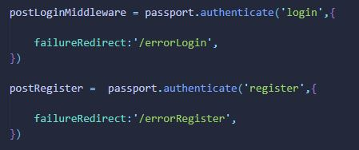

# Ryu Technology

Este site es de una empresa dedicada al rubro tecnológico de la ingeniería de redes y su aplicación en el ámbito de comunicaciones, seguridad, automatización y domótica,
tanto a nivel empresarial como en los hogares. Este ecommerce principalmente trata de un backend que administra una pagina para vender estos productos


## Comenzando 🚀

Este es un proyecto público, puedes decargarte una copia desde la pestaña code o haciendo un Clone 😊

El proyecto está formado por productos de tecnología (laptop, celulares, equipos de networking...) posee un carrito de compras, registro y login para usuarios, consulta de dudas y compras por usuario mediante chat,  consulta de productos por ID, se pueden filtrar los productos por categorias, modificar sus atributos y agregar o eliminar nuevos productos. Igualmente el carro de compras se puede eliminar total o por productos. Una vez se genera la compra, se envia una orden de compra al administrador del página y al cliente.


### Pre-requisitos 📋
#

Este es un proyecto Express.js y javascritp vanilla, por lo que para poder visualizarlo y/o modificarlo necesitas instalar node.js.
Puedes utilizar Visual Studio Code o Sublime Text para revisarlo 🔧, se requiere una cuenta de correo para configurar los envios de mails y una base de datos no relacional, en este
caso se uso mongoDb.

### Instalación
#

Estas instrucciones están hechas para **Visual Studio Code**, con el cual lo realicé:


* Instala **node.js** y **npm** desde https://nodejs.org/es/download/

* En el Visual Studio Code úbicate en el directorio donde vas a colocar el proyecto

* Clona el proyecto con `git clone` + la dirección copiada de git `https://github.com/luiggimarquez/Ryu_technology-backend/tree/Proyecto_Final` en TERMINAL (Ctrl + ñ)

* Instala las dependencias **npm** del proyecto ubicándote en el path donde se encuentra nuestro **package.json** con: `npm install`

* Instala nodemon `npm i -g nodemon`

* Para compilar el proyecto posee dos ambientes, desarrollo y produccion:
   >> Para produccion usar `npm run start:prod`
   >> Para desarollo usar: `npm run start:dev` 

* Abre [http://localhost:8081](http://localhost:8081) para verlo en tu navegador, si estas en env:PROD. Este puerto depende de las configuraciones en los archivos **.env.dev** y .**env.prod**


* Tenemos dos ficheros `.env` en el directorio raíz de nuestra aplicación `.env.dev y .env.prod` Aqui debemos cargar inicialmente los datos de: puertos de escucha de nuestro servidor, y dirección de nuestra base de datos para poder iniciar el app.

>Si ya tienes instalado el node.js resta solamente instalar las npm y compilar el proyecto para comenzar.


## Construido con 🛠️
#

* EL backend del proyecto está desarrollado con `Node.js` V 18.13.0 y `Express.js` 4.18.2

* Los estilos CSS están hechos  en `Visual Studio Code` 1.73.3.

* Como Database se usó `mongoDb`, que es una base de datos no relacional, NoSQL

* Todo el layout de la página esta hecho con flexbox realizado de forma manual.

* `Bootstrap` 5.3.0 solo fue usado para crear el menú desplegable de categorías.

* Se usó la dependencia `Nodemon` v2.0.20 instalada globalmente, con esta corre la selección de ambiente de trabajo.

* Para la vista de mensajes por usuario y todas las órdenes se uso `EJS` como CDN en el frontend.

* Todo la lógica de frontend está escrita en `JavaScript Vanilla` directamente.

* La lógica de autenticación del usuario de basa en dos estrategias de local `passport`, v0.6.0, una para registro y una para login

* Se usó la dependencia `Bcrypt` v5.1.0 para encriptar el password del usuario antes de almacenarlo en la data de datos y para desencriptarlo luego

* Se utilizó una estrategia de passport con JSON Web token para validar los accesos al frontend, usando la dependencia `jsonwebtoken` v9.0.0

* Se utilizó la dependencia `nodemailer` v6.9.1 para enviar los correos de registro y compra hecha.

* Se utilizó la dependencia `cookie-parser` v1.4.6 para enviar y recibir del frontend el token de JSON Web Token

* Se utilizó la dependencia `dotenv` v16.0.3 para acceder a las variables de entorno del `.env`.

* Se utilizó la dependencia  `cross-env` v7.0.3, para seleccionar el ambiente de trabajo, desarrollo o producción

* Se utilizaron `EJS` v3.1.8 y `Express-Handlebars` v6.0.7 como motores de plantilla para cargas vistas en el frontend

* Se tomó logs de informaciones varias con la dependencia `log4js` v6.7.1

* Para guardar las imágenes en el servidor se usó `multer` v1.4.5-lts.1

* Para la conexion con la base de datos se utilizó `mongoose` v6.9.1 y `connect-mongo` v4.6.0

* Para los websockets, se utilizó la dependencia `socket.io` v4.5.4

* Para la sesión del usuario se usó la dependencia `express-session` v1.17.3

* Las imágenes no son de mi autoría, todo es material público en internet.

* Los botones son del sitio https://uiverse.io/

* Los iconos fueron tomados del sitio https://www.iconfinder.com/

* El modal para modificar los atributos de los productos fue tomado y modificado de un ejemplo de https://www.w3schools.com/

## Resumen del proyecto 📜
#

Este Proyecto backend está estructurado en la  arquitectura MVC (Model, Views & Controllers)

>config.js

El proyecto corre en dos development environments, producción y desarrollo `start:prod` y `start:dev` que se ejecutan al iniciar el proyecto. En el archivo ./config.js se ejecuta el ambiente seleccionado. Aqui se importa una variable llamada **config** para poder usar las variables de entorno en todo el proyecto, tiene esta estructura:

**Modelo del .env**:

```
DB = 
PORT = 
MONGOSESSION =
ADMINMAIL=
NODEMAILER_CODE=
CODE_JWT = 
SESSION_TIME = 
JWT_SESSION_TIME = 
NODEMAILER_MAIL = 
NODEMAILER_HOST = 
NODEMAILER_PORT =

```

```
const config = {

    DB : base de datos usada, en este caso solo usaremos mongoDB
    PORT : puerto del servidor
    MONGOSESSION : direccion de la base de datos de mongo Atlas
    ADMINMAIL : email del administrador del sitio, aqui llegan los mails de sistema 
    NODEMAILER_CODE: password del email para configurar envío de mails
    CODE_JWT: password del JSON Web Token
    SESSION_TIME: tiempo de expiración de la sesión en segundos
    JWT_SESSION_TIME: tiempo de expiracion del token de JSON Wen Token, en horas
    NODEMAILER_MAIL: mail para configurar envío del mensajes
    NODEMAILER_HOST: SMTP del mail para envío de mensajes
    NODEMAILER_PORT: Puerto SMTP para envío del mensajes
}

```

>Base de datos

La base de datos, mongoDB, esta configurada en la carpeta `./src/Persistence/mongoDBConfig`, donde se realiza la conexión con la base de datos y es ejecutada desde el server.js como una funcion IIFE. Aquí cargamos la informacion almacenada en **config.MONGOSESSION** del archivo coofig.js; En la carpeta `./src/Persistence/models` tenemos los 5 modelos de colecciones de base de datos usados, a continuacion las colecciones presentes y qué son en el proyecto:

**Usuarios - Colección users**

```
- userName (String): Nombre del cliente 
- userLastName (String): Apellido del cliente
- phone (Number): teléfono del cliente
- email (String): correo electrónico del cliente
- password (String): clave encriptada del cliente
- isAdmin (Boolean): boleano para asignar usuario administrador
- img (String):  avatar seleccionador, si no se proporciona asigna imagen por default 

```

**Productos - Colección products**

```
- name (String): nombre del producto
- price (Number): precio del producto
- thumbnail (String): imagen del producto (path en el servidor)
- description (String): description breve del producto, características
- category (String): categoría del producto
- timestamp (String): fecha de agregado
- stock (Number): cantidad disponible del producto

```

**Carrito - Colección carts**

```
- timestampCart (String): fecha de agregado al carrito
- email (String): email del cliente
- address (String): dirección de envío de la compra
- active (Boolean): carrito actual por usuario, false cuando se termina la compra
- products (Array): artículos agregados:{

    name (String): nombre del artículo agregado
    description (String): descripción breve del artículo agregado
    category (String): categoría del producto
    thumbnail (String): foto del artículo (path en el servidor)
    price (Number): precio del producto
    stock (Number): cantidad disponible
    _id (String): id del producto generado por mongoDb
    timestamp (String): fecha de agregado del producto al DB
    quantity (Number): cantidades agregadas del producto al carrito

}

```

**Orden de Compra - Colección orders**

```
- _id (String): id de la orden de compra, tomado del ID del carrito
- timestamp (String): fecha de la orden de compra
- userName (String): nombre del cliente de la compra
- userLastName (String): apellido del cliente
- phone (Number): Telefono de contacto del cliente
- email (String): email de contacto del cliente
- address (String): dirección de envío de la compra
- totalPay (Number): total a pagar, iva incluído.
- products (Array): artículos agregados:{

    name (String): nombre del artículo agregado
    description (String): descripción breve del artículo agregado
    category (String): categoría del producto
    thumbnail (String): foto del artículo (path en el servidor)
    price (Number): precio del producto
    stock (Number): cantidad disponible
    _id (String): id del producto generado por mongoDb
    timestamp (String): fecha de agregado del producto al DB
    quantity (Number): cantidades agregadas del producto al carrito
}

```

**Mensajes de chat - Colección chats**

```
- timestamp (String): fecha de envío del mensaje
- email (String): email del usuario actual que envía o que recibe una respuesta del admin
- type (String): tipo de mensaje "usuario" o "sistema"
- message (String):  mensaje enviado
- img (String): avatar del usuario, path de la imagen en el servidor

```


## Autenticación
#

>passport.js

Este aerchivo, localizado en `./src/middleware/passport.js` contiene tres estrategías, una para registro de usuario, otra para login de usuario y la tercera para la generacion del JSON web token.

* En la estrategia de registro, se toman los datos enviados del frontend, se valida con MongoDb que no este registrado el usuario, se encripta con `Bcript` el password y se almacena finalmente en la base de datos. En esta parte, se usa el nodemailer para enviar al administrador el mail de registro de un nuevo usuario mediante la función `sendEmailRegister`. Igualmente se crea una firma del JSON Web token para que el usuario pueda navegar en el sitio, con la clave almacenada en `config.CODE_JWT`

*En la estrategia del login, se toman los datos enviados del frontend, se trae el usuario de mongoDb y se valida el password encriptado en la base de datos con el introducido en el login con bcript

De producirse un error en registro o login, se usa la funcion passport para redirigir la respuesta a sus endpoint correspondientes:





* En la estrategia JWT, mediante la funcion `cookieExtractor` tomamos el token enviado desde frontend y compara con el código, posteriormente concederá o negará el acceso

Nuestro token será validado antes de entrar a las rutas los endpoint en server.js


>loginValidator.js

Ademas del token de JWT, se ha implementado una funcion del Passport como middleware para proteger las rutas de ingreso sin login, mediante la función:

```
function loginValidator(req, res, next){

    if(req.isAuthenticated()){
        next()
    }else{
        res.redirect('/login')
    }
}

```
de esta forma, si no existe una sesión iniciada, todos los accesos regresan a /login


## Endpoints
#

El proyecto a una API REST, se han implementado métodos **GET, PUT, POST y DELETE**

>>Endpoints /productos

```
    router.get('/'): Usada para redirigir a la página de /productos o /login, es el root
    router.get('/products'): Usada para cargar los productos en la página
    router.get('/productos'): Usada para cargar la página
    router.get('/products/:id'): Usada para obtener los productos mediante el ID
    router.get('/productos/category/:category'): Usada para filtrar productos por categoría
    router.post('/'): Usada para almacenar los productos en la base de datos
    router.post('/products/imageUpdate'): Usada para modificar la imagen de un producto
    router.put('/products/:id'): Usada para modificar los atributos de un producto
    router.delete('/products/:id'): Usada para borrar un producto por ID
```


>>Endpoints /carrito

```
    routerCart.get('/'): Usada para traer el carro actual
    routerCart.get('/cartPreview'): Usada para cargar la página del carrito
    routerCart.get('/:id/productos'): Usada para cargar los productos del carrito en la página
    routerCart.post('/'): Usada para crear un nuevo carrito
    routerCart.post('/:id/productos'): Usada para agregar un producto al carrito
    routerCart.delete('/:id/productos/:id_prod'): Usada para borrar un producto del carrito
    routerCart.delete('/:id'): Usada para Vaciar el carrito totalmente
    routerCart.put('/:id'): Usada para finalizar el carrito
```

>>Endpoints /orders

```
    routerOrders.get('/'): Usada para obtener todas las ordenes guardadas
    routerOrders.get('/preOrden'): Usada para obtener la orden actual del carrito
    routerOrders.post('/'): Usada para crear una orden al finalizar la compra
    routerOrders.post('/pre-orden'): Usada para guardar la direccion de envío
```


>>Endpoints /chats

```
    routerChat.get('/SalaChat'): Usada para cargar la página del chat
    routerChat.get('/'): Usada para obtener todos los chats almacenados en la DB
    routerChat.get('/:email'): Usada para llamar los chat por email
    routerChat.post('/'): Usada para almacenar los chats en el DB
```

## Template engine
#

>EJS y Handlebars templates

A excepcion del index.html, todas las vistas/páginas del sitio son renderizadas de archivos
en su mayoria EJS, a excepcion de los chats y del /info que son plantillas handlebars. Se encuentras ubicados en la ruta `./public/views/templates`, los cuales son llamados a través de los diferentes endpoints en diferentes etapas del proyecto:

** allOrdes.ejs: contiene la información de todas las ordenes almacenadas
* cart.ejs: contiene la página `/cart/cartPreview`
* errorLogin.ejs: carga la página que muestra error de login
* errorRegister.ejs: carga la pagina que muestra error de registro 
* errors.js: vista cargada cuando se captura un error
* finishedOrder.js: vista cargada cuando se terminó la compra satisfactoriamente
* index.js: vista cargada cuando se ingresa una direccion errónea en el navegador
* logout.ejs: vista cargada cuando se presiona el boton logout
* pre-orden.ejs: vista cargada cuando se pide la dirección de envío
* products.ejs: página productos, donde se listan todos los productos para comprar
* register.ejs: plantilla para registrar un usuario
* sendMailRegister.ejs: plantilla que se envía con los datos de registror por mail
* sendMailOrder.ejs: plantilla que se envía con los datos de la compra por mail
* userLogged: página del perfil de usuario

Los templates de allOrders.js y userMessages.js se cargan como templates en la página del perfil de usuario (userLogged.ejs, get(/userLogged)) 


En el perfil de usuario son llamados con los botones: "órdenes" y  "mensajes"


Handlbars carga la informacion de la sala de Chat, a través del archivo main.handlebars y el archivo partial.handlebars; el archivo infoPartil.handlebars carga toda la página de informacion del sistema:


## Utils
#

>uploadImg.js

Ubicado en `./utils` Para subir imágenes, se usó la dependencia Multer; con esto, se almacena localmente en la carpeta **images** los archivos, y en mongoDB solo se maneja el path hacia la imagen. Se usuario tres funciones:

* uploadImgProducts: para cargar las imágenes al crear un producto; se usa como nombre el id del producto, modificado en el DAO
* uploadImgUsers: para cargar el avatar del usuario. Esta configurado para que si no sube imagen, usa una por defecto, llamada avatar.jpg. Se almacena la imagen con el correo del usuario, modificado en el DAO
* uploadImgProductUpdate: usado para modificar la imágenes de producto ya creado. Este no modifica la informacion de la base de datos, sino, usando el id del producto, sobreescribe localmente la imagen


>emails.js

Ubicado en `.\utils` contiene la configuracion del envío de mail cuando se registra un usuario y cuando se produce una orden de compra; toma los datos de configuración del archivo config.js; aqui se hace render de los arhivos sendMail.js y sendMailOrder.js para enviar a los correos correspondientes; el registro envia un aviso al correo del administrador, registrado en el .env (ADMINMAIL) y para la orden de compra, mediante la variable MailList, envía el mail al cliente, que es el email registrado en la sesión logueada y al correo del administrador

>log.js

Usa log4js, se usa para registrar salidas en pantallas y eventos de errores

>totalPay.js

Función destinada a calcular el total a pagar por una compra.

## Products
#

La página de productos se muestra de dos formas; como usuario se muestra un card con el productos y la opcion para agregarlo:


Si el usuario logueado es administrador, sale con las opciones para modificar (endpoint put('/products/:id' metodo PUT) y eliminar producto ( endpoint 'productos/products/:id' metodo DELETE):


Asimismo, como administrador al final de la pagina sale un div con el menu para agregar un producto (endpoint post('/productos/')):


El menu para editar se presenta al presionar **editar** en el card y abre un modal:


En el NAVBAR tendremos el acceso directo al carrito, el acceso directo a la sala de chat, el acceso al perfil de usuario y el boton para salir de la sesion (logout); mas abajo, esta la seleccion de categoria (endpoint /productos/category/:category' GET ) y la busqueda por ID ( endpoint productos/products/:id' GET)


Si se busca un producto por ID, y no se consigue, el sistema responde con un aviso de " no encontrado" 


AL presionar en el card el boton `add to cart` estaremos llamando al endpoint cart/:id/productos para ir almacenando los articulos en el carrito

Todos los enpoints son hecho mediante Fetch hacia el backend, todos ejecutados en el archivo products.js ubicado en `./public/products.js`


## Carrito
#
EL carrito se abré al presionar en /productos el icono del carrito. Siempre habrá un carrito disponible por usuario, que se crean al cargar /productos. El carrito tiene una variable llamada **active** que controla si un carrito fue finalizado o no, asi se valida con email y active; si hay productos en una sesión y se abre otro momento despues, cargarán esos productos. Cuando el carrito se finaliza, porque se cumplió la compra, esta variable active pasa a false, el carrito se almacena y se crea un nuevo carrito para el usuario. Si el carrito está vacío, se muestra un aviso:


AL agregar productos desde /productos, se habilitan los endpoints borrar articulo (delete('/carrito/:id/productos/:id_prod')), vaciar carrito ( delete('/carrito/:id')) finalizar carrito (put('/carrito/:id')). 


Todos los fetch de estos endpoints son hecho en el archivo cart.js ubicado en `./public/carts.js`. Basicamente consta de dos funciones: loadProducts() y loadCartEmpty(). Cuando se carga la página se ejecuta el fetch GET de /carrito/:id/producto y si tiene productos se cargan o si regresa vacío imprime el aviso de carrito vacío. Al vaciarse el carrito se redirige hacia /productos, creandose un nuevo carrito.


## Pre-Order
#


## Autor✒️


Este proyecto fue realizado para las clases de React.js de CoderHouse por:

**Ing. Luiggi Márquez** - [GitHub Profile](https://github.com/luiggimarquez) ✌️

Buenos Aires, Argentina 2022